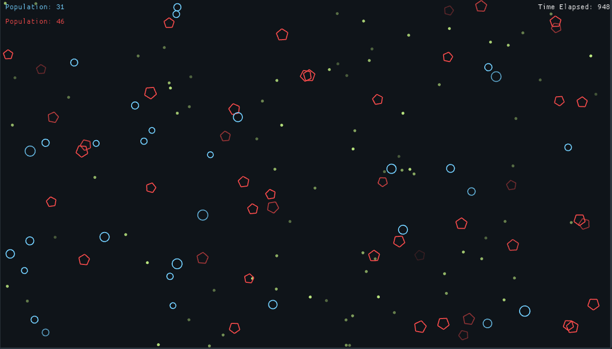

# ECOSIM
Simple ecosystem simulation.

#### Press `S` to save graph in graph.svg.

## RULES
- Food spawns every 3 seconds in random quantity, and each food grain has random energy.
- Blue cells eat the food (green) grains and obtain the energy. They have a reproduction urge which grows on how much energy a food grain contains.
- Red cells eat the blue cells, they only eat the blue cells if their energy is low, they also have a reproduction urge similar to the blue cells.

## Screenshots

